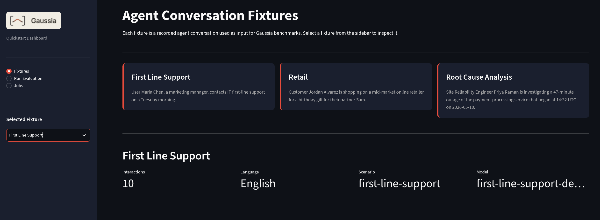

# Evaluate your fleet of autonomous retail agents

Evaluate autonomous retail agent conversations with repeatable benchmarks, EvalHub orchestration, and MLflow run history before they go into production.

## Table of contents

- [Detailed description](#detailed-description)
  - [Architecture](#architecture)
- [Requirements](#requirements)
  - [Hardware requirements](#hardware-requirements)
  - [Software requirements](#software-requirements)
  - [Required user permissions](#required-user-permissions)
- [Deploy](#deploy)
  - [Deploy judge and guardian models](#deploy-judge-and-guardian-models)
  - [Prepare the quickstart project](#prepare-the-quickstart-project)
  - [Install the evaluation platform](#install-the-evaluation-platform)
  - [Demo UI](#demo-ui)
    - [Fixtures](#fixtures)
    - [Run evaluations](#run-evaluations)
    - [View jobs](#view-jobs)
    - [Validate results](#validate-results)
  - [Delete](#delete)
  - [Optional - Use existing EvalHub and MLflow](#optional---use-existing-evalhub-and-mlflow)
- [References](#references)
- [Technical details](#technical-details)
  - [Payload contract](#payload-contract)
  - [Benchmark selection](#benchmark-selection)
  - [Provider registration](#provider-registration)
  - [Model and run metadata](#model-and-run-metadata)
  - [Repository structure](#repository-structure)
- [Tags](#tags)

## Detailed description

Building one agent in a notebook is straightforward. Scaling a fleet of retail agents is a different engineering problem. Once agents execute repeated workflows for real users, manual review cannot reliably catch context loss, inconsistent guidance, safety regressions, or behavior drift across longer sessions.

Teams need a repeatable way to answer practical release and governance questions:

- Did the new agent version preserve context across the full conversation?
- Which benchmark changed after a prompt, model, or retrieval update?
- Can product and engineering teams inspect results in the same place?
- Which model or agent version produced the evaluated conversation?
- Did the agent introduce attribute-level bias, toxic language, or harmful associations that simple keyword filters would miss?

This AI quickstart helps platform, product, and model teams measure autonomous agent quality before agent updates reach production. It uses [Gaussia] as the evaluation provider, EvalHub as the job orchestration layer, and MLflow as the metrics and run history backend. For details on available [Gaussia] metric families and benchmarks, see [Gaussia metric families](docs/gaussia-metric-families.md).

The included scenarios evaluate agents in first-line support, retail assistance, and root-cause analysis workflows. The same pattern applies to IT service desk agents, incident response assistants, customer support agents, and internal operations agents running as part of a larger enterprise AI fleet.


By completing this quickstart, you will:

- Deploy a namespace-scoped OpenShift AI evaluation stack with MLflow, EvalHub, the [Gaussia] provider registration, and quickstart Jobs.
- Submit deterministic agent conversation fixtures as EvalHub jobs without relying on a pre-existing EvalHub service.
- Run the included scenario fixtures with three default benchmarks or six benchmarks when `quickstart.benchmarks=auto`.
- Confirm EvalHub benchmark fan-out and MLflow metric tracking for evaluated agent versions, datasets, and metric families.

### Architecture


**Flow summary:**

1. The quickstart loads a public agent conversation fixture as a [Gaussia]-compatible dataset.
2. The quickstart submits an EvalHub job with one benchmark entry per selected [Gaussia] metric family.
3. EvalHub starts the [Gaussia] provider adapter.
4. The provider evaluates the dataset inside the OpenShift AI environment, reports results to EvalHub, and logs metrics, datasets, sources, and model metadata to MLflow.

## Requirements

### Hardware requirements

| Node Type     | Qty | vCPU | Memory (GB) |
|---------------|-----|------|-------------|
| Control Plane | 3   | 8    | 16          |
| Worker        | 2   | 8    | 32          |

> [!NOTE]
> A GPU is not required for this quickstart

### Software requirements

- Python 3.12+
- [uv](https://docs.astral.sh/uv/) for local quickstart commands
- Helm 3.x.
- GNU Make
- OpenShift CLI `oc`
- Red Hat OpenShift 4.20+
- Red Hat OpenShift AI 3.4+ (with mlflow and evalhub enabled)
- The Gaussia EvalHub provider image pinned by the chart
- Optional judge and guardian API credentials for model-backed benchmarks

### Required user permissions

- Self-contained OpenShift run: permission to create ConfigMaps, Jobs, Pods, Routes, RoleBindings, ServiceAccounts, Services, Deployments, and MLflow custom resources in the target namespace.
- Existing-service flow: EvalHub token with permission to create jobs in the configured tenant.

## Deploy

For an overview of the install, Kubernetes jobs, and expected MLflow output, see **[How it works](docs/how-it-works.md)**.

### Prepare the quickstart project

You will need judge and guardian models to run the full suite of benchmarks. You can set the existing model endpoints in the `.env` file as discussed below. If you will be serving the models locally in OpenShift AI you can follow the instructions in the [Deploy judge and guardian models](docs/judge-and-guardian-models.md) file.

Clone the repository:

```bash
git clone https://github.com/rh-ai-quickstart/Evaluate-agents-with-gaussia-evalhub.git
cd Evaluate-agents-with-gaussia-evalhub
```

Create, edit and view `.env` before installing or running benchmarks:

```bash
make env-init              # copies .env.example → .env
make env-show              # prints loaded values (secrets masked)
make env-verify-provider   # verify judge and guardian models, if already set up
make env-verify-external   # fails if EVALHUB_* placeholders remain (external flow)
```
> [!NOTE]
> List all targets and defaults: `make help`

| Variable group | Required when | Purpose |
| --- | --- | --- |
| `GAUSSIA_JUDGE_*`, `GAUSSIA_GUARDIAN_*`, `GAUSSIA_AGENTIC_*` | `make run-all`, `make upgrade-provider` | Model-backed benchmarks |
| `EVALHUB_*` | `make install-external`, `make run-local` | Point at an existing EvalHub |
| `MLFLOW_TRACKING_URI` | Optional | Override shared-MLflow URI on `make upgrade-provider` |
| `GAUSSIA_EVALUATED_MODEL_*` | Optional | Override evaluated model name/URL in MLflow |

See [.env.example](.env.example) for the full template.

Edit `.env` with your service URLs and credentials. The Makefile and local submitter load `.env` automatically.

Create or select the OpenShift namespace:

```bash
make namespace
```

Optional override: `make namespace NAMESPACE=my-eval-namespace`

### Install the evaluation platform

Install the evaluation platform **once** per namespace. This creates EvalHub, the [Gaussia] provider registration, and MLflow connectivity. Evaluation jobs are separate Helm releases installed in the next steps.

Installation creates the namespace when needed (`make namespace`), disables the bundled submit Job (`job.enabled=false`), and waits for EvalHub (`make wait-evalhub`). 

```bash
make install       
```

**Overrides** (append to any install command):

| Variable | Default | Purpose |
| --- | --- | --- |
| `NAMESPACE` | `gaussia-evalhub-quickstart` | OpenShift project |
| `RELEASE` | `gaussia-evalhub` | Helm release name for the platform stack |
| `MLFLOW_NAMESPACE` | `redhat-ods-applications` | Namespace of the shared MLflow service |
| `MLFLOW_SERVICE` | `mlflow` | Shared MLflow Kubernetes service name |

After install, confirm EvalHub and MLflow are reachable:

```bash
make wait-evalhub
make validate
```

When judge and guardian values are in `.env`, they are applied at install time. To refresh provider settings later without a new run, use `make upgrade-provider`.

### Demo UI

The **Gaussia Quickstart Dashboard** is a simple demo UI for browsing scenario fixtures, submitting evaluations to EvalHub, and inspecting jobs. The UI can be accessed using the following steps:

In the OpenShift web console, go to **Networking** --> **Routes**, and click on the route called **gaussia-ui**.



The UI has three pages:

| Page | Purpose |
| --- | --- |
| **Fixtures** | Inspect first-line support, retail, and root-cause analysis conversation fixtures |
| **Run Evaluation** | Submit `Humanity only` or `All benchmarks` for the selected fixture |
| **Jobs** | List recent EvalHub jobs and fetch a job by id |

Page-by-page walkthrough, local and OpenShift access, and configuration: **[docs/streamlit-ui-guide.md](docs/streamlit-ui-guide.md)** (also see [apps/ui/README.md](apps/ui/README.md)).

#### Fixtures

Select the **Fixtures** page to view the avalable fixtures. You can view the summary of each and their chatbot conversations that will be evaluated by the Gaussia EvalHub provider. Select each one from the drop-down to see the details of each.

#### Run evaluations

Select **Run Evalation** page to start running evaluations. The top section will show all of the available benchmarks that can be run. In this demo, there are only two options:

1. Humanity-only - This evaluation does not require a judge or guardian model
2. All benchmarks - This evaluation requires both judge and guardia models

Select your fixture (chatbot conversation to evaluate) and either the benchmark scope, then click the **Submit** button. The output will show the metadata of the job:

```json
{
  "status":"submitted"
  "job_id":"70ed705b-5110-4922-a54e-cc5cfdddc8dd"
  "request_name":"gaussia-agent-eval-retail-agent-retail-agent-session-20260720183510-retail-control-20260720183510"
    "benchmark_ids":[
     0:"humanity"
     1:"context"
     2:"conversational"
     3:"agentic"
     4:"bias"
     5:"toxicity"
  ]
  "session_id":"retail-agent-session-20260720183510"
  "stream_id":"retail-stream-20260720183510"
  "control_id":"retail-control-20260720183510"
}
```

#### View jobs

Select the **Jobs** page to view the jobs, then click the **Refresh job list** button. The job should show up in the list. While the job is running, the status will show `pending`, then eventually move to `complete`.

Once it is `complete` copy and paste the Job ID into the `Job ID` box in the **Job detail** section, hit Enter, then click the **Get job** button to see the details and results of the evaluation.

#### Validate results

You can now also go into MLflow to view the job details and metrics.

In the OpenShift web console, go to **Networking** --> **Routes**, and click on the route called **mlflow**.

- dataset name beginning with `gaussia-`.
- source name `gaussia.integrations.evalhub.adapter`.
- evaluated model name from fixture metadata, or from `GAUSSIA_EVALUATED_MODEL_NAME` when you override it.
- tags for `assistant_id`, `session_id`, `stream_id`, and `control_id`.

Expected results:


### Delete

Delete the run by run name, uninstall the platform and clean up the namespace.

```bash
make list-releases
make uninstall-run RUN_NAME=<your-run-release>
make uninstall
make cleanup-namespace   # optional; deletes the OpenShift project
```

## References

- [Streamlit UI page guide](docs/streamlit-ui-guide.md)
- [Troubleshoot this quickstart](docs/troubleshooting.md)
- [Gaussia documentation](https://github.com/gaussia-labs/pygaussia)
- [EvalHub provider adapter entrypoint](https://github.com/gaussia-labs/pygaussia)
- [Red Hat AI quickstarts catalog](https://docs.redhat.com/en/learn/ai-quickstarts)

## Technical details

### Payload contract

The public quickstart uses the preferred EvalHub provider contract:

```json
{
  "parameters": {
    "dataset": {
      "session_id": "first-line-support-agent-session",
      "assistant_id": "first-line-support-agent",
      "language": "english",
      "context": "The agent supports first-line IT troubleshooting.",
      "conversation": []
    },
    "metadata": {
      "stream_id": "first-line-support-stream",
      "control_id": "first-line-support-control",
      "source": "gaussia.quickstart.scenario-fixture.v1"
    }
  }
}
```

### Benchmark selection

The quickstart selector always includes:

- `humanity`
- `context`
- `conversational`

When the dataset has five or more interactions, it also includes:

- `bias`
- `toxicity`

When every interaction includes `ground_truth_assistant`, it also includes:

- `agentic`

Use `make run-humanity` when you want the full EvalHub, [Gaussia], and MLflow flow without judge or guardian credentials.

### Provider registration

The Helm chart registers the [Gaussia] provider in EvalHub with provider id `gaussia` and this adapter command:

```bash
python -m gaussia.integrations.evalhub.adapter
```

The provider container runs the [Gaussia] EvalHub adapter with:

```bash
python -m gaussia.integrations.evalhub.adapter
```

The chart pins the EvalHub deployment and sidecar to an immutable `docker.io/alquimiaai/eval-hub` digest through `platform.evalhub.image.fullReference`. Clear that value only when you intentionally want to use the mutable `platform.evalhub.image.repository` and `platform.evalhub.image.tag` fallback.

By default, the chart uses `docker.io/alquimiaai/gaussia-provider:1.1.0b2`, pinned to its published digest, which includes the [Gaussia] EvalHub adapter and CPU-only Torch dependencies. It also pins `gaussia[evalhub]==1.1.0b2` at startup so benchmark dependencies stay explicit.
Override `platform.provider.packageSpec` when the provider pod needs extra LangChain connector packages, such as `langchain-litellm` for LiteLLM. Set `platform.provider.judge.modelProvider` when LangChain cannot infer the provider from the model name.
Override `platform.provider.evalhubSdkSpec` only when you want the provider pod to install a different EvalHub adapter SDK at startup.
Use `platform.provider.image.fullReference` when you need to pin the provider to an internal image registry digest.

### Model and run metadata

The evaluated model is the agent or model version represented by the fixture, not the judge model used by a benchmark. Set these in `.env` or export them before `make run-*`:

```bash
export GAUSSIA_EVALUATED_MODEL_NAME="custom-agent-demo-v1"
export GAUSSIA_EVALUATED_MODEL_URL="https://example.invalid/models/custom-agent-demo-v1"
```

Judge, guardian, agentic, toxicity, and MLflow settings keep the `GAUSSIA_*` and `MLFLOW_*` environment variable names used by the [Gaussia] EvalHub provider.

### Repository structure

```text
.
├── .env.example           # Environment template (EvalHub, MLflow, judge, guardian)
├── Makefile               # Install, run, wait, validate, and uninstall targets
├── apps/
│   ├── ui/                # Streamlit dashboard (see apps/ui/README.md)
│   │   ├── app.py
│   │   ├── Containerfile.ui
│   │   └── requirements.txt
│   └── evalhub_job_submission/  # Submitter, env checks, run waiter, and scenario fixtures
│       ├── check_env.py       # Inspect and verify .env (make env-show, env-verify-*)
│       ├── wait_run.py        # Wait for submit and benchmark jobs (make wait-run)
│       └── submit_evalhub_job.py
├── deploy/
│   └── helm/              # Combined Helm chart (EvalHub, MLflow, provider, UI, jobs)
├── docs/                  # Architecture images and documentation
│   ├── gaussia-metric-families.md  # Available Gaussia benchmarks and metrics
│   ├── how-it-works.md    # What is deployed, run, and evaluated
│   ├── manual-helm-install.md  # Manual Helm installation commands
│   ├── streamlit-ui-guide.md   # Streamlit page-by-page walkthrough
│   └── troubleshooting.md # Common issues and solutions
└── README.md              # Red Hat AI quickstart guide
```

## Tags

- **Title:** Evaluate your fleet of autonomous retail agents
- **Partner:** Alquimia
- **Industry:** Retail
- **Product:** OpenShift AI
- **Use case:** Evaluation
- **Contributor org:** Alquimia AI
