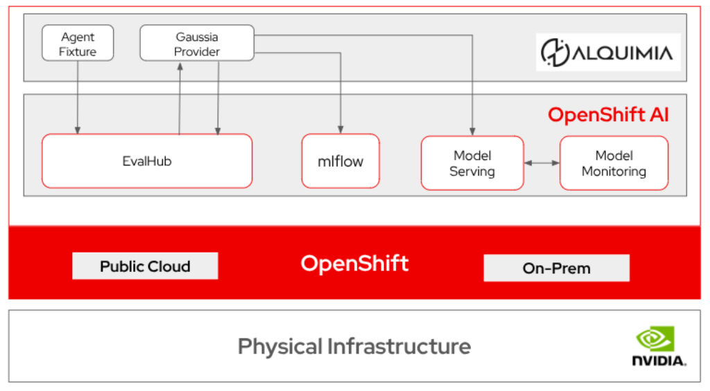
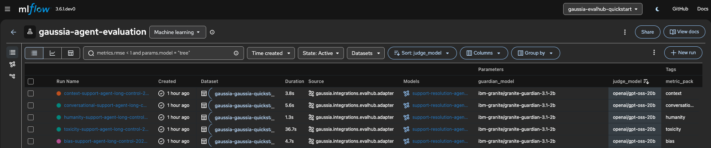
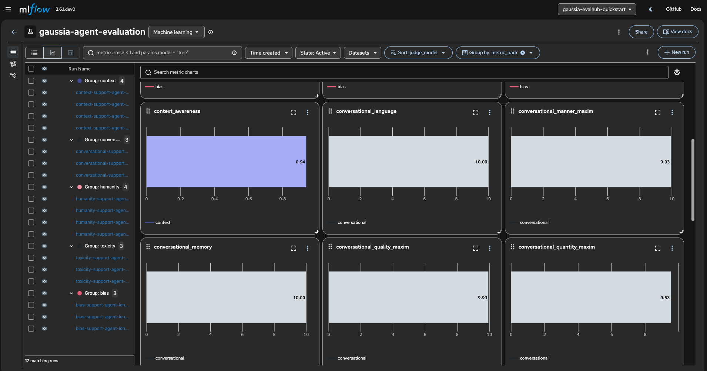

# Evaluate your fleet of autonomous agents with Gaussia

Evaluate autonomous agent conversations with repeatable [Gaussia] benchmarks, EvalHub orchestration, and MLflow run history before they go into production.

## Table of contents

- [Detailed description](#detailed-description)
  - [Architecture](#architecture)
- [Requirements](#requirements)
  - [Hardware requirements](#hardware-requirements)
  - [Software requirements](#software-requirements)
  - [Required user permissions](#required-user-permissions)
- [Deploy](#deploy)
  - [Deploy judge and guardian models](#deploy-judge-and-guardian-models)
  - [Prepare the quickstart project](#prepare-the-quickstart-project)
  - [Install the evaluation platform](#install-the-evaluation-platform)
  - [Run the first evaluation](#run-the-first-evaluation)
  - [Run the full benchmark suite](#run-the-full-benchmark-suite)
  - [Validate results](#validate-results)
  - [Delete](#delete)
  - [Optional - Use existing EvalHub and MLflow](#optional---use-existing-evalhub-and-mlflow)
  - [How it works](docs/how-it-works.md)
- [References](#references)
- [Technical details](#technical-details)
  - [Payload contract](#payload-contract)
  - [Benchmark selection](#benchmark-selection)
  - [Provider registration](#provider-registration)
  - [Model and run metadata](#model-and-run-metadata)
  - [Repository structure](#repository-structure)
- [Tags](#tags)

## Detailed description

Building one agent in a notebook is straightforward. Scaling a fleet of agents across support, retail, SRE, and internal operations workflows is a different engineering problem. Once agents execute repeated workflows for real users, manual review cannot reliably catch context loss, inconsistent guidance, safety regressions, or behavior drift across longer sessions.

Teams need a repeatable way to answer practical release and governance questions:

- Did the new agent version preserve context across the full conversation?
- Which benchmark changed after a prompt, model, or retrieval update?
- Can product and engineering teams inspect results in the same place?
- Which model or agent version produced the evaluated conversation?
- Did the agent introduce attribute-level bias, toxic language, or harmful associations that simple keyword filters would miss?

This AI quickstart helps platform, product, and model teams measure autonomous agent quality before agent updates reach production. It uses [Gaussia] as the evaluation provider, EvalHub as the job orchestration layer, and MLflow as the metrics and run history backend. For details on available [Gaussia] metric families and benchmarks, see [Gaussia metric families](docs/gaussia-metric-families.md).

The included scenarios evaluate agents in first-line support, retail assistance, and root-cause analysis workflows. The same pattern applies to IT service desk agents, incident response assistants, customer support agents, and internal operations agents running as part of a larger enterprise AI fleet.


By completing this quickstart, you will:

- Deploy a namespace-scoped OpenShift AI evaluation stack with MLflow, EvalHub, the [Gaussia] provider registration, and quickstart Jobs.
- Submit deterministic agent conversation fixtures as EvalHub jobs without relying on a pre-existing EvalHub service.
- Run the included scenario fixtures with three default benchmarks or six benchmarks when `quickstart.benchmarks=auto`.
- Confirm EvalHub benchmark fan-out and MLflow metric tracking for evaluated agent versions, datasets, and metric families.

### Architecture



**Flow summary:**

1. The quickstart loads a public agent conversation fixture as a [Gaussia]-compatible dataset.
2. The quickstart submits an EvalHub job with one benchmark entry per selected [Gaussia] metric family.
3. EvalHub starts the [Gaussia] provider adapter.
4. The provider evaluates the dataset inside the OpenShift AI environment, reports results to EvalHub, and logs metrics, datasets, sources, and model metadata to MLflow.

## Requirements

### Hardware requirements

- 

### Software requirements

- Python 3.12+
- [uv](https://docs.astral.sh/uv/) for local quickstart commands
- Helm 3.x.
- GNU Make
- OpenShift CLI `oc`
- Red Hat OpenShift 4.20+
- Red Hat OpenShift AI 3.4+ (with mlflow and evalhub enabled)
- The Gaussia EvalHub provider image pinned by the chart
- Optional judge and guardian API credentials for model-backed benchmarks

### Required user permissions

- Self-contained OpenShift run: permission to create ConfigMaps, Jobs, Pods, Routes, RoleBindings, ServiceAccounts, Services, Deployments, and MLflow custom resources in the target namespace.
- Existing-service flow: EvalHub token with permission to create jobs in the configured tenant.

## Deploy

For an overview of the install, Kubernetes jobs, and expected MLflow output, see **[How it works](docs/how-it-works.md)**.

### Deploy judge and guardian models

The default `humanity` benchmark can run without external model endpoints. To run the full benchmark set, deploy a judge model and a guardian model in Red Hat OpenShift AI before installing this quickstart. The models named below are suggested examples, not hard requirements. You can use different models if they expose compatible endpoints and produce stable responses for the benchmark role.

| Model role | Used by | Deployment requirement |
| --- | --- | --- |
| Judge model | `context`, `conversational`, and `agentic` | OpenAI-compatible chat completions endpoint exposed at `/v1`. |
| Guardian model | `bias` | OpenAI-compatible chat completions endpoint exposed at `/v1`. |

Deploy the suggested judge model:

1. In OpenShift AI, open the model catalog and search for `gpt-oss-20b`.
2. Open the model detail page and select **Deploy model**.
3. Use model location `URI` with `oci://registry.redhat.io/rhelai1/modelcar-gpt-oss-20b:1.5`.
4. Set model type to `Generative AI model (Example: LLM)`.
5. Review the deployment settings, deploy the model, and wait until the endpoint is ready.
6. Copy the model route, token, and served model name.

Deploy the suggested guardian model:

1. Download the `ibm-granite/granite-guardian-3.1-2b` model artifacts and upload them to S3-compatible object storage, such as MinIO.
2. In the OpenShift AI project, create an S3-compatible data connection that points to the bucket and path containing the guardian model.
3. Deploy a model from the existing data connection and set model type to `Generative AI model (Example: LLM)`.
4. Use a vLLM/KServe serving runtime with a GPU-capable hardware profile.
5. Enable the external route and token authentication.
6. Wait until the endpoint is ready, then copy the model route, token, and served model name.

Add the resulting values to `.env`:

```bash
GAUSSIA_JUDGE_MODEL="<judge-served-model-name>"
GAUSSIA_JUDGE_MODEL_PROVIDER="openai"
GAUSSIA_JUDGE_BASE_URL="https://<judge-route>/v1"
GAUSSIA_JUDGE_API_KEY="<judge-token>"
GAUSSIA_JUDGE_USE_STRUCTURED_OUTPUT="false"
GAUSSIA_PROVIDER_PACKAGE_SPEC="gaussia[evalhub]==1.1.0b2 langchain-openai"

GAUSSIA_GUARDIAN_MODEL="<guardian-served-model-name>"
GAUSSIA_GUARDIAN_TOKENIZER_MODEL="ibm-granite/granite-guardian-3.1-2b"
GAUSSIA_GUARDIAN_BASE_URL="https://<guardian-route>/v1"
GAUSSIA_GUARDIAN_API_KEY="<guardian-token>"
GAUSSIA_GUARDIAN_CHAT_COMPLETIONS="true"
```

Set `GAUSSIA_JUDGE_MODEL_PROVIDER` to the LangChain provider that matches your judge endpoint. Use `openai` for OpenShift AI or LiteLLM routes that expose an OpenAI-compatible `/v1` API. Custom served model names such as `llama-scout-17b` require this setting because LangChain cannot infer the provider from the model name alone.

Keep `GAUSSIA_GUARDIAN_CHAT_COMPLETIONS="true"` when the guardian uses Groq or another OpenAI-compatible chat endpoint. Setting it to `false` selects the legacy `/completions` endpoint, which Groq does not expose for chat models.

If you already have compatible judge and guardian endpoints, use those values instead.

### Prepare the quickstart project

Clone the repository:

```bash
git clone https://github.com/rh-ai-quickstart/Evaluate-agents-with-gaussia-evalhub.git
cd Evaluate-agents-with-gaussia-evalhub
```

Create, edit and view `.env` before installing or running benchmarks:

```bash
make env-init              # copies .env.example → .env
make env-show              # prints loaded values (secrets masked)
make env-verify-provider   # verify judge and guardian models, if already set up
make env-verify-external   # fails if EVALHUB_* placeholders remain (external flow)
```
> [!NOTE]
> List all targets and defaults: `make help`

| Variable group | Required when | Purpose |
| --- | --- | --- |
| `GAUSSIA_JUDGE_*`, `GAUSSIA_GUARDIAN_*`, `GAUSSIA_AGENTIC_*` | `make run-all`, `make upgrade-provider` | Model-backed benchmarks |
| `EVALHUB_*` | `make install-external`, `make run-local` | Point at an existing EvalHub |
| `MLFLOW_TRACKING_URI` | Optional | Override shared-MLflow URI on `make upgrade-provider` |
| `GAUSSIA_EVALUATED_MODEL_*` | Optional | Override evaluated model name/URL in MLflow |

See [.env.example](.env.example) for the full template.

Edit `.env` with your service URLs and credentials. The Makefile and local submitter load `.env` automatically.

Create or select the OpenShift namespace:

```bash
make namespace
```

Optional override: `make namespace NAMESPACE=my-eval-namespace`

### Install the evaluation platform

Install the evaluation platform **once** per namespace. This creates EvalHub, the [Gaussia] provider registration, and MLflow connectivity. Evaluation jobs are separate Helm releases installed in the next steps.

Installation creates the namespace when needed (`make namespace`), disables the bundled submit Job (`job.enabled=false`), and waits for EvalHub (`make wait-evalhub`). 

```bash
make install               
```

**Overrides** (append to any install command):

| Variable | Default | Purpose |
| --- | --- | --- |
| `NAMESPACE` | `gaussia-evalhub-quickstart` | OpenShift project |
| `RELEASE` | `gaussia-evalhub` | Helm release name for the platform stack |
| `MLFLOW_NAMESPACE` | `redhat-ods-applications` | Namespace of the shared MLflow service |
| `MLFLOW_SERVICE` | `mlflow` | Shared MLflow Kubernetes service name |

After install, confirm EvalHub and MLflow are reachable:

```bash
make wait-evalhub
make validate
```

When judge and guardian values are in `.env`, they are applied at install time. To refresh provider settings later without a new run, use `make upgrade-provider`.

### Run the first evaluation

Submit a humanity-only evaluation against the installed EvalHub service. `make run-humanity` installs the run release, waits for the submit Job and benchmark Job to finish, and prints the run release name.

> [!NOTE]
> The default `humanity` benchmark does not require external judge or guardian credentials. It still exercises the full flow: quickstart Job, EvalHub job creation, [Gaussia] provider execution, and MLflow run logging.

```bash
make run-humanity
```

Optional overrides:

```bash
make run-humanity FIXTURE=retail RUN_NAME=my-humanity-run
```

Quickstart submit Job resource overrides:

| Variable | Default |
| --- | --- |
| `JOB_CPU_REQUEST` | `250m` |
| `JOB_MEMORY_REQUEST` | `512Mi` |
| `JOB_CPU_LIMIT` | `1` |
| `JOB_MEMORY_LIMIT` | `1Gi` |

Available use-cases (fixtures):

| Fixture | Scenario | Interactions |
| --- | --- | --- |
| `first-line-support` | IT first-line support troubleshooting | 10 |
| `retail` | Retail shopping and support assistant | 10 |
| `root-cause-analysis` | SRE root-cause analysis assistant | 10 |

Follow submit logs or re-wait for an existing run:

```bash
make logs RUN_NAME=<name-from-run-output>
make wait-run RUN_NAME=<name>
```

Use a new `RUN_NAME` for each run, or remove the previous run first: `make uninstall-run RUN_NAME=...`

### Run the full benchmark suite

`run-all` runs `upgrade-provider` first, then waits for six benchmarks. Complete [Deploy judge and guardian models](#deploy-judge-and-guardian-models) and fill judge and guardian values in `.env`, then verify:

```bash
make env-verify-provider    # verify judge and guardian models before run-all
```

Run all benchmarks (`make run-all` applies provider settings from `.env`, submits the job, and waits for completion):

```bash
make run-all RUN_NAME=gaussia-evalhub-run-all-$(date +%H%M%S)
```

Optional overrides: `FIXTURE=retail`, or run provider update separately before a manual re-run:

```bash
make upgrade-provider
make run-all RUN_NAME=my-run-all
```

Expected submit output includes:

```json
{
  "status": "submitted",
  "job_id": "...",
  "benchmark_ids": [
    "humanity",
    "context",
    "conversational",
    "agentic",
    "bias",
    "toxicity"
  ]
}
```

### Validate results

Use these checks to confirm the quickstart completed:

```bash
make validate
make logs RUN_NAME=<your-run-release>
```

In EvalHub, confirm that the selected fixture created one top-level job. With `quickstart.benchmarks=auto`, the included fixtures create six benchmark jobs.

In MLflow, confirm that each benchmark run includes:

- dataset name beginning with `gaussia-`.
- source name `gaussia.integrations.evalhub.adapter`.
- evaluated model name from fixture metadata, or from `GAUSSIA_EVALUATED_MODEL_NAME` when you override it.
- tags for `assistant_id`, `session_id`, `stream_id`, and `control_id`.

Expected results:





### Delete

Delete the run by run name, uninstall the platform and clean up the namespace.

```bash
make list-releases
make uninstall-run RUN_NAME=<your-run-release>
make uninstall
make cleanup-namespace   # optional; deletes the OpenShift project
```

### Optional - Use existing EvalHub and MLflow

If your platform team already provides EvalHub, MLflow, and a registered `gaussia` provider, configure `EVALHUB_*` in `.env`, then:

```bash
make env-verify-external
make install-external FIXTURE=first-line-support RUN_NAME=my-external-run
```

Submit from your workstation instead of a cluster Job:

```bash
make run-local FIXTURE=first-line-support
```

## References

- [Troubleshoot this quickstart](docs/troubleshooting.md)
- [Gaussia documentation](https://github.com/gaussia-labs/pygaussia)
- [EvalHub provider adapter entrypoint](https://github.com/gaussia-labs/pygaussia)
- [Red Hat AI quickstarts catalog](https://docs.redhat.com/en/learn/ai-quickstarts)

## Technical details

### Payload contract

The public quickstart uses the preferred EvalHub provider contract:

```json
{
  "parameters": {
    "dataset": {
      "session_id": "first-line-support-agent-session",
      "assistant_id": "first-line-support-agent",
      "language": "english",
      "context": "The agent supports first-line IT troubleshooting.",
      "conversation": []
    },
    "metadata": {
      "stream_id": "first-line-support-stream",
      "control_id": "first-line-support-control",
      "source": "gaussia.quickstart.scenario-fixture.v1"
    }
  }
}
```

### Benchmark selection

The quickstart selector always includes:

- `humanity`
- `context`
- `conversational`

When the dataset has five or more interactions, it also includes:

- `bias`
- `toxicity`

When every interaction includes `ground_truth_assistant`, it also includes:

- `agentic`

Use `make run-humanity` when you want the full EvalHub, [Gaussia], and MLflow flow without judge or guardian credentials.

### Provider registration

The Helm chart registers the [Gaussia] provider in EvalHub with provider id `gaussia` and this adapter command:

```bash
python -m gaussia.integrations.evalhub.adapter
```

The provider container runs the [Gaussia] EvalHub adapter with:

```bash
python -m gaussia.integrations.evalhub.adapter
```

By default, the chart uses `docker.io/alquimiaai/gaussia-provider:1.1.0b2`, pinned to its published digest, which includes the [Gaussia] EvalHub adapter and CPU-only Torch dependencies. It also pins `gaussia[evalhub]==1.1.0b2` at startup so benchmark dependencies stay explicit.
Override `platform.provider.packageSpec` when the provider pod needs extra LangChain connector packages, such as `langchain-litellm` for LiteLLM. Set `platform.provider.judge.modelProvider` when LangChain cannot infer the provider from the model name.
Override `platform.provider.evalhubSdkSpec` only when you want the provider pod to install a different EvalHub adapter SDK at startup.
Use `platform.provider.image.fullReference` when you need to pin the provider to an internal image registry digest.

### Model and run metadata

The evaluated model is the agent or model version represented by the fixture, not the judge model used by a benchmark. Set these in `.env` or export them before `make run-*`:

```bash
export GAUSSIA_EVALUATED_MODEL_NAME="custom-agent-demo-v1"
export GAUSSIA_EVALUATED_MODEL_URL="https://example.invalid/models/custom-agent-demo-v1"
```

Judge, guardian, agentic, toxicity, and MLflow settings keep the `GAUSSIA_*` and `MLFLOW_*` environment variable names used by the [Gaussia] EvalHub provider.

### Repository structure

```text
.
├── .env.example           # Environment template (EvalHub, MLflow, judge, guardian)
├── Makefile               # Install, run, wait, validate, and uninstall targets
├── apps/
│   ├── ui/                # Streamlit dashboard (see apps/ui/README.md)
│   │   ├── app.py
│   │   ├── Containerfile.ui
│   │   └── requirements.txt
│   └── evalhub_job_submission/  # Submitter, env checks, run waiter, and scenario fixtures
│       ├── check_env.py       # Inspect and verify .env (make env-show, env-verify-*)
│       ├── wait_run.py        # Wait for submit and benchmark jobs (make wait-run)
│       └── submit_evalhub_job.py
├── deploy/
│   └── helm/              # Combined Helm chart (EvalHub, MLflow, provider, UI, jobs)
├── docs/                  # Architecture images and documentation
│   ├── gaussia-metric-families.md  # Available Gaussia benchmarks and metrics
│   ├── how-it-works.md    # What is deployed, run, and evaluated
│   ├── manual-helm-install.md  # Manual Helm installation commands
│   └── troubleshooting.md # Common issues and solutions
└── README.md              # Red Hat AI quickstart guide
```

## Tags

- **Title:** Scaling enterprise AI fleets with Gaussia and EvalHub
- **Description:** Evaluate autonomous agent conversations with repeatable [Gaussia] benchmarks, EvalHub orchestration, and MLflow run history on Red Hat OpenShift AI.
- **Business challenge:** Adopt and scale AI
- **Product:** OpenShift AI, OpenShift
- **Use case:** Agent evaluation, model observability, governance, continuous improvement
- **Contributor org:** Alquimia AI

[Gaussia]: https://github.com/gaussia-labs/pygaussia
