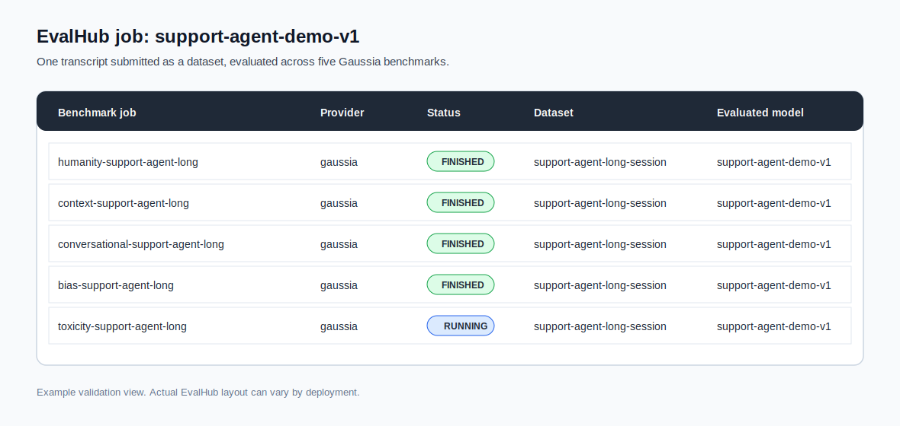
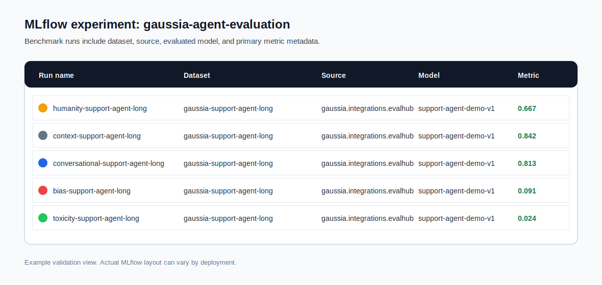

# Measure agent quality with Gaussia and EvalHub

Use this AI quickstart on Red Hat® OpenShift® AI to evaluate agent conversations with repeatable Gaussia benchmarks, EvalHub jobs, and MLflow metrics.

## Table of contents

- [Detailed description](#detailed-description)
  - [The challenge](#the-challenge)
  - [Our solution](#our-solution)
  - [What you'll build](#what-youll-build)
  - [See it in action](#see-it-in-action)
  - [Architecture diagrams](#architecture-diagrams)
- [Requirements](#requirements)
  - [Minimum software requirements](#minimum-software-requirements)
  - [Required user permissions](#required-user-permissions)
- [Deploy](#deploy)
  - [Prerequisites](#prerequisites)
  - [Quick start - OpenShift smoke job](#quick-start---openshift-smoke-job)
  - [Submit a live EvalHub job on OpenShift](#submit-a-live-evalhub-job-on-openshift)
  - [Local smoke test](#local-smoke-test)
  - [Validate results](#validate-results)
  - [Delete](#delete)
- [References](#references)
- [Technical details](#technical-details)
  - [Payload contract](#payload-contract)
  - [Benchmark selection](#benchmark-selection)
  - [Provider registration](#provider-registration)
  - [Model and run metadata](#model-and-run-metadata)
  - [Repository structure](#repository-structure)
- [Tags](#tags)

## Detailed description

This AI quickstart helps platform, product, and model teams measure agent quality with repeatable evaluation jobs. It uses Gaussia as the evaluation provider, EvalHub as the job orchestration layer, and MLflow as the metrics and run history backend.

The included scenario evaluates a first-line support agent handling an application release incident. The same pattern applies to IT service desk agents, incident response assistants, customer support agents, and internal operations agents.

### The challenge

Agentic systems are hard to assess with manual review alone. A support agent may sound helpful in one response while losing context, giving inconsistent guidance, or drifting into weaker behavior over a longer session.

Teams need a repeatable way to answer practical release questions:

- Did the new agent version preserve context across the full conversation?
- Which benchmark changed after a prompt, model, or retrieval update?
- Can product and engineering teams inspect results in the same place?
- Which model or agent version produced the evaluated transcript?

### Our solution

This quickstart turns an agent transcript into an EvalHub job and evaluates it with Gaussia benchmarks. EvalHub fans out benchmark work, the Gaussia provider computes metrics, and MLflow records the evaluated model, dataset, source, tags, metrics, and artifacts.

The primary flow is source-runtime agnostic. Any system that can produce `dataset + metadata` can create the same EvalHub job. Alquimia Runtime is documented as an optional source path, not as a dependency of the quickstart.

### What you'll build

By completing this quickstart, you will:

- Deploy an OpenShift Job that runs a Gaussia provider smoke test.
- Submit a live EvalHub job for a deterministic agent transcript.
- Run three benchmarks for a short transcript and five benchmarks for a longer transcript.
- Confirm EvalHub benchmark fan-out and MLflow metric tracking.
- Understand how to connect an external source system, including Alquimia Runtime, to the same evaluation flow.

### See it in action

The default smoke path runs the `humanity` benchmark against a deterministic agent transcript and prints EvalHub-compatible results:

```json
{
  "benchmark_id": "humanity",
  "model_name": "support-agent-demo-v1",
  "num_examples_evaluated": 5,
  "evaluation_metadata": {
    "payload_source": "dataset",
    "primary_metric_name": "humanity_assistant_emotional_entropy"
  }
}
```

When connected to EvalHub and MLflow, the long transcript creates one EvalHub job, five benchmark jobs, and one MLflow run per benchmark.





### Architecture diagrams


**Flow summary:**

1. A source system exports an agent transcript as a Gaussia-compatible dataset.
2. The quickstart submits an EvalHub job with one benchmark entry per selected Gaussia metric family.
3. EvalHub starts the Gaussia provider adapter with `python -m gaussia.integrations.evalhub.adapter`.
4. The provider evaluates the dataset, reports results to EvalHub, and logs metrics, datasets, sources, and model metadata to MLflow.

## Requirements

### Minimum software requirements

- Python 3.12+.
- [uv](https://docs.astral.sh/uv/) for local quickstart commands.
- Helm 3.x.
- OpenShift CLI `oc`.
- Red Hat OpenShift 4.18+.
- Red Hat OpenShift AI 2.16+ when using OpenShift AI hosted MLflow or model-serving endpoints.
- A public release of `gaussia[evalhub]`.
- EvalHub endpoint and token for live job submission.
- MLflow tracking endpoint for persisted benchmark runs.

### Required user permissions

- Local smoke test: no cluster permissions.
- EvalHub submit job: EvalHub token with permission to create jobs in the configured tenant.
- OpenShift smoke job: namespace-level permission to create ConfigMaps, Secrets, Jobs, Pods, and ServiceAccounts.
- Provider registration in a shared EvalHub installation may require platform administrator access, depending on how EvalHub is managed in your environment.

## Deploy

### Prerequisites

Clone the repository:

```bash
git clone https://github.com/rh-ai-quickstart/Evaluate-agents-with-gaussian-evalhub.git
cd Evaluate-agents-with-gaussian-evalhub
```

For live EvalHub submission, confirm that EvalHub has a provider with:

- provider id `gaussia`
- command `python -m gaussia.integrations.evalhub.adapter`
- an image or runtime environment that installs `gaussia[evalhub]`
- access to any required `GAUSSIA_*` judge, guardian, toxicity, and `MLFLOW_*` settings

### Quick Start - OpenShift smoke job

Create a namespace and install the Helm chart in smoke mode:

```bash
export NAMESPACE="gaussia-evalhub-quickstart"

oc new-project "${NAMESPACE}"

helm install gaussia-evalhub ./chart \
  --namespace "${NAMESPACE}" \
  --set mode=smoke \
  --set quickstart.fixture=long \
  --set quickstart.benchmarks=humanity
```

Watch the job:

```bash
oc logs job/gaussia-evalhub-smoke -n "${NAMESPACE}" -f
```

The smoke job does not call EvalHub or MLflow. It verifies that the Gaussia EvalHub adapter can load the fixture and produce benchmark results.

### Submit a live EvalHub job on OpenShift

Configure EvalHub access:

```bash
export EVALHUB_BASE_URL="https://evalhub.example.com"
export EVALHUB_AUTH_TOKEN="<token>"
export EVALHUB_TENANT="default"
export EVALHUB_INSECURE="false"
export EVALHUB_EXPERIMENT_NAME="gaussia-agent-evaluation"
export GAUSSIA_EVALUATED_MODEL_NAME="support-agent-demo-v1"
export GAUSSIA_EVALUATED_MODEL_URL="https://example.invalid/models/support-agent-demo-v1"
```

Install in submit mode:

```bash
helm upgrade --install gaussia-evalhub ./chart \
  --namespace "${NAMESPACE}" \
  --set mode=submit \
  --set quickstart.fixture=long \
  --set quickstart.benchmarks=auto \
  --set quickstart.uniqueRun=true \
  --set evalhub.baseUrl="${EVALHUB_BASE_URL}" \
  --set evalhub.authToken="${EVALHUB_AUTH_TOKEN}" \
  --set evalhub.tenant="${EVALHUB_TENANT}" \
  --set evalhub.insecure="${EVALHUB_INSECURE}" \
  --set evalhub.experimentName="${EVALHUB_EXPERIMENT_NAME}" \
  --set evaluatedModel.name="${GAUSSIA_EVALUATED_MODEL_NAME}" \
  --set evaluatedModel.url="${GAUSSIA_EVALUATED_MODEL_URL}"
```

For production-style usage, create the secret separately and set `evalhub.existingSecret` instead of passing `evalhub.authToken` on the command line.

To rerun the same mode with different values, uninstall the release first. Kubernetes Jobs are immutable after creation.

Expected output includes:

```json
{
  "status": "submitted",
  "job_id": "...",
  "benchmark_ids": [
    "humanity",
    "context",
    "conversational",
    "bias",
    "toxicity"
  ]
}
```

### Local smoke test

Run the adapter locally with the long fixture and the `humanity` benchmark. This path does not require EvalHub, MLflow, OpenShift, judge credentials, or guardian credentials.

```bash
uv run \
  --with "gaussia[evalhub]" \
  python quickstart/local_provider_smoke.py \
    --fixture quickstart/fixtures/agent_transcript_long.json \
    --benchmarks humanity
```

To use the benchmark selector locally, run:

```bash
uv run \
  --with "gaussia[evalhub]" \
  python quickstart/local_provider_smoke.py \
    --fixture quickstart/fixtures/agent_transcript_long.json \
    --benchmarks auto
```

The long fixture selects `humanity`, `context`, `conversational`, `bias`, and `toxicity`. Configure the required `GAUSSIA_*` judge, guardian, and toxicity settings before running model-backed benchmarks.

You can also submit a live EvalHub job from your workstation:

```bash
uv run \
  --with "gaussia[evalhub]" \
  --with "eval-hub-sdk[client]==0.1.5" \
  python quickstart/submit_evalhub_job.py \
    --fixture quickstart/fixtures/agent_transcript_long.json \
    --benchmarks auto \
    --unique-run
```

### Validate results

Use these checks to confirm the quickstart completed:

```bash
oc get jobs,pods -n "${NAMESPACE}"
oc logs job/gaussia-evalhub-submit -n "${NAMESPACE}"
```

In EvalHub, confirm that the long fixture created one top-level job with five benchmark jobs.

In MLflow, confirm that each benchmark run includes:

- dataset name beginning with `gaussia-`.
- source name `gaussia.integrations.evalhub.adapter`.
- evaluated model name from `GAUSSIA_EVALUATED_MODEL_NAME`.
- tags for `assistant_id`, `session_id`, `stream_id`, and `control_id`.

### Delete

Remove the Helm release:

```bash
helm uninstall gaussia-evalhub --namespace "${NAMESPACE}"
```

Delete the namespace if it was created only for this quickstart:

```bash
oc delete project "${NAMESPACE}"
```

## References

- [Gaussia documentation](https://github.com/gaussia-labs/pygaussia)
- [EvalHub provider adapter entrypoint](https://github.com/gaussia-labs/pygaussia)
- [Red Hat AI quickstart template](https://github.com/rh-ai-quickstart/ai-quickstart-template)
- [Alquimia Runtime integration notes](docs/alquimia-runtime-integration.md)

## Technical details

### Payload contract

The public quickstart uses the preferred EvalHub provider contract:

```json
{
  "parameters": {
    "dataset": {
      "session_id": "support-agent-long-session",
      "assistant_id": "support-resolution-agent",
      "language": "english",
      "context": "The agent supports first-line incident triage.",
      "conversation": []
    },
    "metadata": {
      "stream_id": "support-agent-long-stream",
      "control_id": "support-agent-long-control",
      "source": "gaussia.quickstart.agent-transcript.v1"
    }
  }
}
```

The Gaussia EvalHub adapter still accepts the legacy `context_persistance` payload for systems that already emit it. New integrations should use `dataset + metadata`.

### Benchmark selection

The quickstart selector always includes:

- `humanity`
- `context`
- `conversational`

When the dataset has five or more interactions, it also includes:

- `bias`
- `toxicity`

Use `--benchmarks humanity` for a no-credential smoke test.

### Provider registration

EvalHub must know how to run the Gaussia provider before the live submit path can create executable benchmark jobs. Register the provider with the `gaussia` provider id and this adapter command:

```bash
python -m gaussia.integrations.evalhub.adapter
```

The provider image should install:

```bash
uv add "gaussia[evalhub]"
```

### Model and run metadata

The evaluated model is the agent or model version represented by the transcript, not the judge model used by a benchmark. Set it with:

```bash
export GAUSSIA_EVALUATED_MODEL_NAME="support-agent-demo-v1"
export GAUSSIA_EVALUATED_MODEL_URL="https://example.invalid/models/support-agent-demo-v1"
```

Judge, guardian, toxicity, and MLflow settings keep the `GAUSSIA_*` and `MLFLOW_*` environment variable names used by the Gaussia EvalHub provider.

### Repository structure

```text
.
├── chart/                 # Minimal Helm chart for smoke and EvalHub submit jobs
├── docs/                  # Integration notes and architecture images
├── quickstart/            # Local runners and public agent transcript fixtures
└── README.md              # Red Hat AI quickstart guide
```

## Tags

- **Title:** Measure agent quality with Gaussia and EvalHub
- **Description:** Evaluate agent conversations with repeatable Gaussia benchmarks, EvalHub jobs, and MLflow metrics on Red Hat OpenShift AI.
- **Business challenge:** Adopt and scale AI
- **Product:** OpenShift AI, OpenShift
- **Use case:** Agent evaluation, model observability, continuous improvement
- **Contributor org:** Alquimia AI
