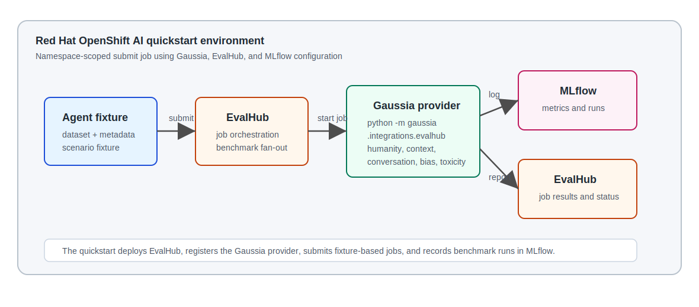

# Measure agent quality with Gaussia and EvalHub

Use this AI quickstart on Red Hat® OpenShift® AI to evaluate agent conversations with repeatable [Gaussia] benchmarks, EvalHub jobs, and MLflow metrics.

## Table of contents

- [Detailed description](#detailed-description)
  - [The challenge](#the-challenge)
  - [Our solution](#our-solution)
  - [Metric families](#gaussia-metric-families)
  - [What you'll build](#what-youll-build)
  - [See it in action](#see-it-in-action)
  - [Architecture diagrams](#architecture-diagrams)
- [Requirements](#requirements)
  - [Minimum software requirements](#minimum-software-requirements)
  - [Required user permissions](#required-user-permissions)
- [Deploy](#deploy)
  - [Step 1 - Deploy judge and guardian models](#step-1---deploy-judge-and-guardian-models)
  - [Step 2 - Prepare the quickstart project](#step-2---prepare-the-quickstart-project)
  - [Step 3 - Install the evaluation platform](#step-3---install-the-evaluation-platform)
  - [Step 4 - Run the first evaluation](#step-4---run-the-first-evaluation)
  - [Step 5 - Run the full benchmark suite](#step-5---run-the-full-benchmark-suite)
  - [Step 6 - Validate results](#step-6---validate-results)
  - [Step 7 - Clean up](#step-7---clean-up)
  - [Optional - Use existing EvalHub and MLflow](#optional---use-existing-evalhub-and-mlflow)
- [References](#references)
- [Technical details](#technical-details)
  - [Payload contract](#payload-contract)
  - [Benchmark selection](#benchmark-selection)
  - [Provider registration](#provider-registration)
  - [Model and run metadata](#model-and-run-metadata)
  - [Repository structure](#repository-structure)
- [Tags](#tags)

## Detailed description

This AI quickstart helps platform, product, and model teams measure agent quality with repeatable evaluation jobs. It uses [Gaussia] as the evaluation provider, EvalHub as the job orchestration layer, and MLflow as the metrics and run history backend.

The included scenarios evaluate agents in first-line support, retail assistance, and root-cause analysis workflows. The same pattern applies to IT service desk agents, incident response assistants, customer support agents, and internal operations agents.

### The challenge

Agentic systems are hard to assess with manual review alone. A support agent may sound helpful in one response while losing context, giving inconsistent guidance, or drifting into weaker behavior over a longer session.

Teams need a repeatable way to answer practical release questions:

- Did the new agent version preserve context across the full conversation?
- Which benchmark changed after a prompt, model, or retrieval update?
- Can product and engineering teams inspect results in the same place?
- Which model or agent version produced the evaluated conversation?

### Our solution

This quickstart turns a fixture-based agent conversation into an EvalHub job and evaluates it with [Gaussia] benchmarks. EvalHub fans out benchmark work, the [Gaussia] provider computes metrics, and MLflow records the evaluated model, dataset, source, tags, metrics, and artifacts.

The primary flow is fully contained in the Red Hat OpenShift AI environment created by the quickstart: a submit Job sends `dataset + metadata` to EvalHub, EvalHub runs the [Gaussia] provider, and MLflow stores the evaluation history.

### Gaussia metric families

[Gaussia] is a Python evaluation framework for measuring AI assistant and agent behavior across conversation quality, context use, safety, and response style. In this quickstart, [Gaussia] runs as an EvalHub provider: EvalHub creates one benchmark job per selected metric family, and each benchmark writes structured results to MLflow.

The quickstart currently exposes these [Gaussia] metric families through the EvalHub provider:

| Metric family | What it measures | Typical signal |
| --- | --- | --- |
| `humanity` | Emotional profile and human-like response tone using lexicon-based emotion distributions. | Emotional entropy and emotion balance across assistant responses. |
| `context` | Whether the assistant answer stays aligned with the provided conversation context. | Context-awareness score for the session. |
| `conversational` | Dialogue quality across memory, language, Grice's maxims, and sensibleness. | Multi-dimension conversational scores from an LLM judge. |
| `agentic` | Whether the evaluated agent answer matches the expected answer in ground-truth fixtures. | Correct interactions, correctness rate, `pass@k`, and `pass^k`. |
| `bias` | Potential biased behavior across protected attributes such as gender, race, religion, nationality, and sexual orientation. | Attribute-level bias rates and aggregate bias score. |
| `toxicity` | Toxic language and harmful association patterns across detected groups. | Toxicity, directed toxicity, sentiment bias, and group dispersion metrics. |

The `humanity` benchmark can run without external judge credentials. The `context`, `conversational`, `agentic`, and `bias` benchmarks require judge or guardian model settings because they use model-backed evaluation. The `toxicity` benchmark uses embedding and lexicon-based analysis.

[Gaussia] also includes additional metric families that can be used when the dataset or evaluation workflow requires a different signal. They are useful extension points for future EvalHub provider benchmarks:

| Metric family | What it measures | Typical signal |
| --- | --- | --- |
| `best_of` | Head-to-head comparison of multiple assistant responses for the same prompt or conversation. | Winning assistant id, contest history, judge confidence, verdict, and reasoning. |
| `regulatory` | Whether an assistant response is supported or contradicted by a regulatory or policy corpus. | Compliance score, verdict, supporting chunks, contradicting chunks, and retrieved evidence. |
| `vision_similarity` | Semantic similarity between a vision-language model description and human ground truth. | Mean, minimum, and maximum similarity across frames or examples. |
| `vision_hallucination` | Whether a vision-language model describes content that does not match the ground truth scene. | Hallucination rate, number of hallucinated frames, and per-frame similarity. |

### What you'll build

By completing this quickstart, you will:

- Deploy a namespace-scoped evaluation stack with MLflow, EvalHub, the [Gaussia] provider registration, and a quickstart Job.
- Submit a live EvalHub job for a deterministic agent conversation fixture without relying on a pre-existing EvalHub service.
- Run the included scenario fixtures with three default benchmarks or six benchmarks when `quickstart.benchmarks=auto`.
- Confirm EvalHub benchmark fan-out and MLflow metric tracking.

### See it in action

The default path submits the `first-line-support` fixture to EvalHub, runs the `humanity` benchmark with the [Gaussia] provider, and records the benchmark run in MLflow:

```json
{
  "status": "submitted",
  "job_id": "...",
  "benchmark_ids": [
    "humanity"
  ],
  "session_id": "first-line-support-agent-session-20260508184548"
}
```

The [Gaussia] provider then reports benchmark results back through EvalHub:

```json
{
  "benchmark_id": "humanity",
  "model_name": "first-line-support-demo-v1",
  "num_examples_evaluated": 10,
  "evaluation_metadata": {
    "payload_source": "dataset",
    "primary_metric_name": "humanity_assistant_emotional_entropy"
  }
}
```

With `quickstart.benchmarks=auto`, the included fixtures create one EvalHub job, six benchmark jobs, and one MLflow run per benchmark.

### Architecture diagrams



**Flow summary:**

1. The quickstart loads a public agent conversation fixture as a [Gaussia]-compatible dataset.
2. The quickstart submits an EvalHub job with one benchmark entry per selected [Gaussia] metric family.
3. EvalHub starts the [Gaussia] provider adapter with `python -m gaussia.integrations.evalhub.adapter`.
4. The provider evaluates the dataset, reports results to EvalHub, and logs metrics, datasets, sources, and model metadata to MLflow.

## Requirements

### Minimum software requirements

- Python 3.12+.
- [uv](https://docs.astral.sh/uv/) for local quickstart commands.
- Helm 3.x.
- OpenShift CLI `oc`.
- Red Hat OpenShift 4.18+.
- Red Hat OpenShift AI 2.16+ with the MLflow custom resource available.
- A public release of `gaussia[evalhub]`.
- Optional judge and guardian API credentials for model-backed benchmarks.

### Required user permissions

- Self-contained OpenShift run: permission to create ConfigMaps, Jobs, Pods, Routes, RoleBindings, ServiceAccounts, Services, Deployments, and MLflow custom resources in the target namespace.
- Existing-service flow: EvalHub token with permission to create jobs in the configured tenant.

## Deploy

### Step 1 - Deploy judge and guardian models

The default `humanity` benchmark can run without external model endpoints. To run the full benchmark set, deploy a judge model and a guardian model in Red Hat OpenShift AI before installing this quickstart.

| Model role | Used by | Deployment requirement |
| --- | --- | --- |
| Judge model | `context`, `conversational`, and `agentic` | OpenAI-compatible chat completions endpoint exposed at `/v1`. |
| Guardian model | `bias` | OpenAI-compatible chat completions endpoint exposed at `/v1`. |

Deploy the judge model:

1. In OpenShift AI, open the model catalog and search for `gpt-oss-20b`.
2. Open the model detail page and select **Deploy model**.
3. Use model location `URI` with `oci://registry.redhat.io/rhelai1/modelcar-gpt-oss-20b:1.5`.
4. Set model type to `Generative AI model (Example: LLM)`.
5. Review the deployment settings, deploy the model, and wait until the endpoint is ready.
6. Copy the model route, token, and served model name.

Deploy the guardian model:

1. Download the `ibm-granite/granite-guardian-3.1-2b` model artifacts and upload them to S3-compatible object storage, such as MinIO.
2. In the OpenShift AI project, create an S3-compatible data connection that points to the bucket and path containing the guardian model.
3. Deploy a model from the existing data connection and set model type to `Generative AI model (Example: LLM)`.
4. Use a vLLM/KServe serving runtime with a GPU-capable hardware profile.
5. Enable the external route and token authentication.
6. Wait until the endpoint is ready, then copy the model route, token, and served model name.

Add the resulting values to `.env`:

```bash
GAUSSIA_JUDGE_MODEL="<judge-served-model-name>"
GAUSSIA_JUDGE_BASE_URL="https://<judge-route>/v1"
GAUSSIA_JUDGE_API_KEY="<judge-token>"
GAUSSIA_JUDGE_USE_STRUCTURED_OUTPUT="false"

GAUSSIA_GUARDIAN_MODEL="<guardian-served-model-name>"
GAUSSIA_GUARDIAN_TOKENIZER_MODEL="ibm-granite/granite-guardian-3.1-2b"
GAUSSIA_GUARDIAN_BASE_URL="https://<guardian-route>/v1"
GAUSSIA_GUARDIAN_API_KEY="<guardian-token>"
GAUSSIA_GUARDIAN_CHAT_COMPLETIONS="true"
```

If you already have compatible judge and guardian endpoints, use those values instead.

### Step 2 - Prepare the quickstart project

Clone the repository:

```bash
git clone https://github.com/rh-ai-quickstart/Evaluate-agents-with-gaussia-evalhub.git
cd Evaluate-agents-with-gaussia-evalhub
```

Create a local environment file for EvalHub, MLflow, judge, and guardian settings:

```bash
cp .env.example .env
```

Edit `.env` with your service URLs and credentials. The local submitter loads `.env` automatically. For Helm commands, load it into your shell first:

```bash
set -a
source .env
set +a
```

Create a namespace for the quickstart:

```bash
export NAMESPACE="gaussia-evalhub-quickstart"
oc new-project "${NAMESPACE}"
```

Available fixtures:

| Fixture | Scenario | Interactions |
| --- | --- | --- |
| `first-line-support` | IT first-line support troubleshooting | 10 |
| `retail` | Retail shopping and support assistant | 10 |
| `root-cause-analysis` | SRE root-cause analysis assistant | 10 |

### Step 3 - Install the evaluation platform

Install the quickstart platform once. This creates EvalHub, the [Gaussia] provider registration, and MLflow in the same namespace. Jobs will be launched separately in the next steps:

```bash
helm install gaussia-evalhub ./chart \
  --namespace "${NAMESPACE}" \
  --set job.enabled=false
```

If the namespace already has an OpenShift AI MLflow instance named `mlflow`, use it instead of creating a new one:

```bash
helm install gaussia-evalhub ./chart \
  --namespace "${NAMESPACE}" \
  --set job.enabled=false \
  --set platform.mlflow.create=false
```

If MLflow is shared from another namespace, keep the EvalHub tenant as the quickstart namespace and create a local `mlflow` service alias that points to the shared service:

```bash
export MLFLOW_NAMESPACE="redhat-ods-applications"

helm install gaussia-evalhub ./chart \
  --namespace "${NAMESPACE}" \
  --set job.enabled=false \
  --set platform.mlflow.create=false \
  --set platform.mlflow.serviceAlias.enabled=true \
  --set platform.mlflow.serviceAlias.externalName="mlflow.${MLFLOW_NAMESPACE}.svc.cluster.local" \
  --set platform.mlflow.trackingUri="https://mlflow.${MLFLOW_NAMESPACE}.svc:8443" \
  --set platform.mlflow.workspace="${NAMESPACE}" \
  --set platform.mlflow.rbacNamespace="${NAMESPACE}"
```

Wait for EvalHub to be ready:

```bash
oc rollout status deploy/gaussia-evalhub-evalhub -n "${NAMESPACE}"
```

### Step 4 - Run the first evaluation

Launch a quickstart Job as a separate release against the installed EvalHub service:

```bash
helm install gaussia-evalhub-run-001 ./chart \
  --namespace "${NAMESPACE}" \
  --set platform.enabled=false \
  --set quickstart.fixture=first-line-support \
  --set quickstart.benchmarks=humanity \
  --set quickstart.uniqueRun=true \
  --set evalhub.baseUrl="http://gaussia-evalhub-evalhub:8080" \
  --set evalhub.tenant="${NAMESPACE}"
```

Watch only that run:

```bash
oc logs job/gaussia-evalhub-run-001-submit -n "${NAMESPACE}" -f
```

The default `humanity` benchmark does not require external judge or guardian credentials. It still exercises the full flow: quickstart Job, EvalHub job creation, [Gaussia] provider execution, and MLflow run logging.

Use a new release name for each run, such as `gaussia-evalhub-run-002`, or uninstall the previous run release before reusing its name.

### Step 5 - Run the full benchmark suite

To run `context`, `conversational`, `agentic`, `bias`, and `toxicity`, use the judge and guardian endpoints from Step 1, fill their settings in `.env`, and load them into your shell:

```bash
set -a
source .env
set +a
```

Update the provider registration with the model-backed benchmark settings:

```bash
helm upgrade gaussia-evalhub ./chart \
  --namespace "${NAMESPACE}" \
  --set job.enabled=false \
  --set-string platform.provider.judge.model="${GAUSSIA_JUDGE_MODEL}" \
  --set-string platform.provider.judge.baseUrl="${GAUSSIA_JUDGE_BASE_URL}" \
  --set-string platform.provider.judge.apiKey="${GAUSSIA_JUDGE_API_KEY}" \
  --set-string platform.provider.guardian.model="${GAUSSIA_GUARDIAN_MODEL}" \
  --set-string platform.provider.guardian.tokenizerModel="${GAUSSIA_GUARDIAN_TOKENIZER_MODEL}" \
  --set-string platform.provider.guardian.baseUrl="${GAUSSIA_GUARDIAN_BASE_URL}" \
  --set-string platform.provider.guardian.apiKey="${GAUSSIA_GUARDIAN_API_KEY}" \
  --set-string platform.provider.guardian.chatCompletions="${GAUSSIA_GUARDIAN_CHAT_COMPLETIONS}" \
  --set-string platform.provider.agentic.k="${GAUSSIA_AGENTIC_K}" \
  --set-string platform.provider.agentic.threshold="${GAUSSIA_AGENTIC_THRESHOLD}" \
  --set-string platform.provider.agentic.toolThreshold="${GAUSSIA_AGENTIC_TOOL_THRESHOLD}"
```

Then launch an all-benchmark run as a separate Job release:

```bash
helm install gaussia-evalhub-run-all-001 ./chart \
  --namespace "${NAMESPACE}" \
  --set platform.enabled=false \
  --set quickstart.fixture=first-line-support \
  --set quickstart.benchmarks=auto \
  --set quickstart.uniqueRun=true \
  --set evalhub.baseUrl="http://gaussia-evalhub-evalhub:8080" \
  --set evalhub.tenant="${NAMESPACE}"
```

Expected output includes:

```json
{
  "status": "submitted",
  "job_id": "...",
  "benchmark_ids": [
    "humanity",
    "context",
    "conversational",
    "agentic",
    "bias",
    "toxicity"
  ]
}
```

### Step 6 - Validate results

Use these checks to confirm the quickstart completed:

```bash
oc get mlflow,deploy,svc,route,jobs,pods -n "${NAMESPACE}"
oc logs job/gaussia-evalhub-run-001-submit -n "${NAMESPACE}"
```

In EvalHub, confirm that the selected fixture created one top-level job. With `quickstart.benchmarks=auto`, the included fixtures create six benchmark jobs.

In MLflow, confirm that each benchmark run includes:

- dataset name beginning with `gaussia-`.
- source name `gaussia.integrations.evalhub.adapter`.
- evaluated model name from fixture metadata, or from `GAUSSIA_EVALUATED_MODEL_NAME` when you override it.
- tags for `assistant_id`, `session_id`, `stream_id`, and `control_id`.

Expected results:


### Step 7 - Clean up

Remove any run releases you created:

```bash
helm uninstall gaussia-evalhub-run-001 --namespace "${NAMESPACE}"
helm uninstall gaussia-evalhub-run-all-001 --namespace "${NAMESPACE}"
```

Remove the platform release:

```bash
helm uninstall gaussia-evalhub --namespace "${NAMESPACE}"
```

Delete the namespace if it was created only for this quickstart:

```bash
oc delete project "${NAMESPACE}"
```

### Optional - Use existing EvalHub and MLflow

If your platform team already provides EvalHub, MLflow, and a registered `gaussia` provider, configure `EVALHUB_BASE_URL`, `EVALHUB_AUTH_TOKEN`, and `EVALHUB_TENANT` in `.env`, then disable the embedded platform and point the quickstart Job at that endpoint:

```bash
helm install gaussia-evalhub ./chart \
  --namespace "${NAMESPACE}" \
  --set platform.enabled=false \
  --set quickstart.fixture=first-line-support \
  --set quickstart.benchmarks=auto \
  --set quickstart.uniqueRun=true \
  --set evalhub.baseUrl="${EVALHUB_BASE_URL}" \
  --set evalhub.authToken="${EVALHUB_AUTH_TOKEN}" \
  --set evalhub.tenant="${EVALHUB_TENANT}" \
  --set evalhub.insecure=false
```

You can also submit a live EvalHub job from your workstation:

```bash
uv run \
  --with "gaussia[evalhub]" \
  --with "eval-hub-sdk[client]==0.1.5" \
  python quickstart/submit_evalhub_job.py \
    --fixture quickstart/fixtures/first-line-support.json \
    --benchmarks auto \
    --unique-run
```

## References

- [Gaussia documentation](https://github.com/gaussia-labs/pygaussia)
- [EvalHub provider adapter entrypoint](https://github.com/gaussia-labs/pygaussia)
- [Red Hat AI quickstarts catalog](https://docs.redhat.com/en/learn/ai-quickstarts)

## Technical details

### Payload contract

The public quickstart uses the preferred EvalHub provider contract:

```json
{
  "parameters": {
    "dataset": {
      "session_id": "first-line-support-agent-session",
      "assistant_id": "first-line-support-agent",
      "language": "english",
      "context": "The agent supports first-line IT troubleshooting.",
      "conversation": []
    },
    "metadata": {
      "stream_id": "first-line-support-stream",
      "control_id": "first-line-support-control",
      "source": "gaussia.quickstart.scenario-fixture.v1"
    }
  }
}
```

### Benchmark selection

The quickstart selector always includes:

- `humanity`
- `context`
- `conversational`

When the dataset has five or more interactions, it also includes:

- `bias`
- `toxicity`

When every interaction includes `ground_truth_assistant`, it also includes:

- `agentic`

Use `quickstart.benchmarks=humanity` when you want the full EvalHub, [Gaussia], and MLflow flow without judge or guardian credentials.

### Provider registration

The Helm chart registers the [Gaussia] provider in EvalHub with provider id `gaussia` and this adapter command:

```bash
python -m gaussia.integrations.evalhub.adapter
```

The provider container runs the [Gaussia] EvalHub adapter with:

```bash
python -m gaussia.integrations.evalhub.adapter
```

By default, the chart uses a provider image with the [Gaussia] EvalHub adapter already installed. Override `platform.provider.packageSpec` and `platform.provider.evalhubSdkSpec` only when you want the provider pod to install packages at startup.
Use `platform.provider.image.fullReference` when you need to pin the provider to an internal image registry digest.

### Model and run metadata

The evaluated model is the agent or model version represented by the fixture, not the judge model used by a benchmark. Set it with:

```bash
export GAUSSIA_EVALUATED_MODEL_NAME="custom-agent-demo-v1"
export GAUSSIA_EVALUATED_MODEL_URL="https://example.invalid/models/custom-agent-demo-v1"
```

Judge, guardian, agentic, toxicity, and MLflow settings keep the `GAUSSIA_*` and `MLFLOW_*` environment variable names used by the [Gaussia] EvalHub provider.

### Repository structure

```text
.
├── .env.example           # Local environment template for EvalHub, MLflow, judge, and guardian settings
├── chart/                 # Helm chart for MLflow, EvalHub, provider registration, and quickstart jobs
├── docs/                  # Architecture and results images
├── quickstart/            # EvalHub submitter and public scenario fixtures
└── README.md              # Red Hat AI quickstart guide
```

## Tags

- **Title:** Measure agent quality with Gaussia and EvalHub
- **Description:** Evaluate agent conversations with repeatable [Gaussia] benchmarks, EvalHub jobs, and MLflow metrics on Red Hat OpenShift AI.
- **Business challenge:** Adopt and scale AI
- **Product:** OpenShift AI, OpenShift
- **Use case:** Agent evaluation, model observability, continuous improvement
- **Contributor org:** Alquimia AI

[Gaussia]: https://github.com/gaussia-labs/pygaussia
