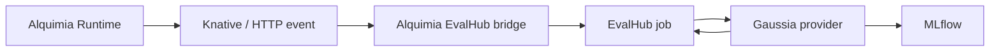

# Alquimia Runtime integration

The main quickstart is source-runtime agnostic. It starts from an agent transcript represented as `dataset + metadata` and submits that payload to EvalHub.

Alquimia Runtime is one possible source system for those transcripts. Use the Alquimia bridge only when the source system does not create EvalHub jobs directly.

## Runtime flow



## Responsibilities

The Alquimia bridge owns:

- HTTP or Knative event ingestion.
- Event deduplication.
- Normalization of Alquimia Runtime conversation events.
- EvalHub job creation.

The Gaussia EvalHub provider owns:

- Loading EvalHub `JobSpec.parameters`.
- Converting the payload into a Gaussia dataset.
- Running the selected Gaussia benchmark.
- Reporting EvalHub results.
- Logging metrics, dataset inputs, source metadata, and model metadata to MLflow.

## Payload contract

The public quickstart uses the preferred provider contract:

```json
{
  "parameters": {
    "dataset": {
      "session_id": "support-agent-long-session",
      "assistant_id": "support-resolution-agent",
      "language": "english",
      "context": "The agent supports first-line incident triage.",
      "conversation": []
    },
    "metadata": {
      "source": "gaussia.quickstart.agent-transcript.v1",
      "stream_id": "support-agent-long-stream",
      "control_id": "support-agent-long-control"
    }
  }
}
```

The Alquimia bridge may still submit the legacy-compatible `context_persistance` payload while existing Runtime contracts are migrated. The provider accepts that spelling for compatibility. New source systems should create `dataset + metadata` directly.

## When the bridge is not needed

Skip the Alquimia bridge when the source system can already:

- Produce a Gaussia-compatible dataset.
- Choose the benchmark list.
- Submit `JobSubmissionRequest` to EvalHub.
- Provide stable metadata for `assistant_id`, `session_id`, `stream_id`, and `control_id`.

In that case, use `quickstart/submit_evalhub_job.py` as the reference implementation.
