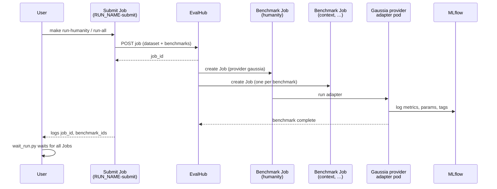

# How the quickstart works

This document explains what the Gaussia EvalHub quickstart **deploys**, what it **runs**, which **jobs** are created, and what you should expect to **see** when it completes successfully.

For install and run commands, see the [README](../README.md#deploy).

## What the quickstart demonstrates

The quickstart turns a **fixed agent conversation** (a JSON fixture) into a repeatable evaluation pipeline on Red Hat OpenShift AI:

1. A conversation dataset is submitted to **EvalHub** as an evaluation job.
2. EvalHub fans out **one benchmark run per metric family** to the registered **Gaussia** provider.
3. The Gaussia provider evaluates the conversation and logs **metrics, tags, and run metadata** to **MLflow**.

You are not deploying a live agent. The fixtures are deterministic scenario transcripts (IT support, retail, SRE) that stand in for agent output. The same pattern applies when a real agent runtime exports conversations in the same dataset shape.

## Two kinds of Helm releases

The chart supports two modes, controlled by Helm values. The Makefile uses both, but **never in the same release**.

| Release | Make target | `platform.enabled` | `job.enabled` | Purpose |
| --- | --- | --- | --- | --- |
| **Platform** | `make install`, `make install-standalone`, … | `true` | `false` | Long-lived EvalHub stack, provider registration, MLflow connectivity |
| **Run** | `make run-humanity`, `make run-all`, … | `false` | `true` | One-shot submit Job that posts a fixture to EvalHub |

```text
┌─────────────────────────────────────────────────────────────────┐
│  Platform release (once): gaussia-evalhub                       │
│  EvalHub Deployment · Gaussia provider ConfigMap · MLflow link   │
└─────────────────────────────────────────────────────────────────┘
                              ▲
                              │ HTTP submit
┌─────────────────────────────────────────────────────────────────┐
│  Run release (per evaluation): gaussia-evalhub-run-<timestamp>  │
│  Job: <RUN_NAME>-submit  →  calls EvalHub API                  │
└─────────────────────────────────────────────────────────────────┘
```

Platform and run releases can coexist in the same namespace. Remove run releases with `make uninstall-run RUN_NAME=...`; remove the platform with `make uninstall`.

## What is deployed (platform install)

When you run `make install` (or `make install-standalone`), Helm creates the **evaluation platform** in your OpenShift namespace.

### EvalHub

| Resource | Name (default) | Role |
| --- | --- | --- |
| Deployment | `gaussia-evalhub-evalhub` | EvalHub API and job orchestrator |
| Service | `gaussia-evalhub-evalhub` | Cluster DNS at `http://gaussia-evalhub-evalhub:8080` |
| ConfigMap | `gaussia-evalhub-evalhub-config` | EvalHub service config (SQLite DB, MLflow URI, workspace) |
| Route | optional | External access when enabled in chart values |

EvalHub stores job state in a local SQLite database (`file:/tmp/evalhub.db`). It reads MLflow settings from the mounted config and uses the pod service account token to talk to MLflow.

### Gaussia provider registration

| Resource | Name (default) | Role |
| --- | --- | --- |
| ConfigMap | `gaussia-evalhub-evalhub-providers` | Registers provider id `gaussia` and six benchmarks |

The provider manifest tells EvalHub how to launch benchmark workers:

- **Image:** Gaussia provider container (from chart values).
- **Entrypoint:** installs pinned Python packages, then runs `python -m gaussia.integrations.evalhub.adapter`.
- **Environment:** judge, guardian, agentic, toxicity, and MLflow settings (from `.env` when passed through Helm).

EvalHub does **not** run the provider continuously. It starts a **Kubernetes Job per benchmark** when you submit an evaluation.

### MLflow connectivity

Depending on the install variant:

| Variant | Make target | What is created |
| --- | --- | --- |
| **Local MLflow CR** | `make install-standalone` | `MLflow` custom resource named `mlflow` in the quickstart namespace |
| **Shared MLflow** | `make install` | ExternalName `Service` alias `mlflow` pointing at shared MLflow (e.g. in `redhat-ods-applications`) |
| **Existing CR** | `make install-no-mlflow` | Uses existing `mlflow` CR; chart skips MLflow creation |

EvalHub and Gaussia provider pods use a tracking URI such as `https://mlflow.<namespace>.svc:8443` and an MLflow **workspace** set to the quickstart namespace for RBAC.

### RBAC and identity

| Resource | Role |
| --- | --- |
| ServiceAccount `gaussia-evalhub-platform` | Used by EvalHub and provider benchmark pods |
| RoleBinding → `edit` | Lets EvalHub create benchmark Jobs in the namespace |
| MLflow workspace Role/RoleBinding | Grants experiment and run access in the MLflow workspace namespace |

### What platform install does *not* create

- No submit Job (`job.enabled=false`).
- No evaluation runs in MLflow until you run `make run-humanity` or `make run-all`.

## What is run (evaluation release)

When you run `make run-humanity` or `make run-all`, Helm installs a **separate release** with `platform.enabled=false` and `job.enabled=true`.

| Resource | Name | Role |
| --- | --- | --- |
| Job | `<RUN_NAME>-submit` | Loads a fixture, waits for EvalHub (and optionally MLflow), submits one EvalHub job |
| ConfigMap | `<RUN_NAME>-quickstart` | Fixture JSON and `run_quickstart.py` baked into the Job pod |

The submit Job:

1. Reads `apps/evalhub_job_submission/fixtures/<fixture>.json` (default: `first-line-support`).
2. Selects benchmarks (`humanity` only, or `auto` for the full set).
3. Calls the EvalHub REST API with a `JobSubmissionRequest` containing the dataset, metadata, model info, and benchmark list.
4. Prints JSON to its logs, for example:

```json
{
  "status": "submitted",
  "job_id": "...",
  "benchmark_ids": ["humanity"],
  "session_id": "first-line-support-agent-session-20260508184548"
}
```

`make run-humanity` and `make run-all` then call `apps/evalhub_job_submission/wait_run.py`, which waits for the submit Job and for all benchmark Jobs tied to that `job_id`.

## Job flow end to end



### 1. Submit Job (quickstart)

- **Created by:** Helm run release.
- **Lifetime:** Runs once; exits when submission succeeds or fails.
- **Backoff:** `backoffLimit: 0` (no retries).

### 2. EvalHub top-level job

- **Created by:** EvalHub when the submit Job calls `client.jobs.submit(...)`.
- **Represents:** One evaluation request for one fixture / agent session.
- **Contains:** One benchmark entry per selected metric family, all using provider `gaussia` and the same dataset payload.

### 3. Benchmark Jobs (EvalHub → Kubernetes)

- **Created by:** EvalHub for **each** benchmark in the submission (e.g. six Jobs for `benchmarks=auto`).
- **Label:** `job_id=<evalhub-job-id>` (used by `wait_run.py` to track progress).
- **Pod command:** Gaussia EvalHub adapter (`python -m gaussia.integrations.evalhub.adapter`) with benchmark-specific env from the provider ConfigMap.
- **Work:** Score the conversation for that metric family; write results to MLflow; report status back to EvalHub.

For `make run-humanity`, expect **one** benchmark Job. For `make run-all` on the default fixtures, expect **six** benchmark Jobs.

## Fixtures and benchmark selection

Fixtures live under `apps/evalhub_job_submission/fixtures/`:

| Fixture | Scenario |
| --- | --- |
| `first-line-support` | IT first-line VPN troubleshooting |
| `retail` | Retail shopping and support |
| `root-cause-analysis` | SRE root-cause analysis |

Each fixture is a JSON object with:

- **`dataset`:** `session_id`, `assistant_id`, `context`, and `conversation` (turns with `query`, `assistant`, optional `ground_truth_assistant`).
- **`metadata`:** `stream_id`, `control_id`, `source`, and optional evaluated model overrides.

Benchmark selection (`quickstart.benchmarks`):

| Value | Benchmarks run |
| --- | --- |
| `humanity` | `humanity` only |
| `auto` | See table below |

For `auto`, the selector in `run_quickstart.py` / `common.py` applies:

| Benchmark | Included when |
| --- | --- |
| `humanity`, `context`, `conversational` | Always |
| `agentic` | Every conversation turn has `ground_truth_assistant` |
| `bias`, `toxicity` | Five or more conversation turns |

Default fixtures have 10 turns and ground truth on every turn, so **`auto` runs all six benchmarks**.

### Benchmark summary

| Benchmark | Measures | External models required |
| --- | --- | --- |
| `humanity` | Emotional tone / entropy across assistant replies | No |
| `context` | Answer alignment with conversation context | Judge model |
| `conversational` | Dialogue quality (memory, Grice, sensibleness) | Judge model |
| `agentic` | Match to `ground_truth_assistant` in fixture | Judge model |
| `bias` | Bias across protected attributes | Guardian model |
| `toxicity` | Toxic language and harmful associations | No (embeddings / lexicon) |

## What you should see when it works

### In submit Job logs

After `make run-humanity` or `make run-all`:

```bash
make logs RUN_NAME=<your-run-release>
```

Look for `status: submitted`, a non-empty `job_id`, and the `benchmark_ids` list.

### In the namespace

```bash
make validate
```

You should see:

- Platform Deployment `gaussia-evalhub-evalhub` **Running**.
- Completed submit Job `<RUN_NAME>-submit`.
- Completed (or running) benchmark Jobs labeled with your EvalHub `job_id`.

### In EvalHub

One top-level job per run release submission. With `auto`, that job fans out to six benchmark executions (each backed by a Kubernetes Job).

### In MLflow

One **run per benchmark** (six runs for a full `auto` evaluation), typically showing:

| Field | Example |
| --- | --- |
| Experiment | `gaussia-agent-evaluation` (from `EVALHUB_EXPERIMENT_NAME`) |
| Dataset | Name prefixed with `gaussia-` |
| Source | `gaussia.integrations.evalhub.adapter` |
| Evaluated model | From fixture metadata or `GAUSSIA_EVALUATED_MODEL_NAME` |
| Tags | `assistant_id`, `session_id`, `stream_id`, `control_id` |
| Metrics | Benchmark-specific (e.g. `humanity_assistant_emotional_entropy`, `context_awareness`, `bias_score`) |

See [expected MLflow screenshots](../README.md#step-6---validate-results) in the README.

## Makefile map

| Phase | Targets |
| --- | --- |
| Setup | `env-init`, `env-show`, `env-verify-provider`, `namespace` |
| Install platform | `install`, `install-standalone`, `install-no-mlflow`, `wait-evalhub` |
| Run evaluation | `run-humanity`, `run-all`, `install-external`, `run-local` |
| Wait / inspect | `wait-run`, `logs`, `validate`, `list-releases` |
| Remove | `uninstall-run`, `uninstall`, `cleanup-namespace` |

## External EvalHub path

If you already have EvalHub and a registered Gaussia provider (`make install-external` or `make run-local`):

- **Nothing** from the platform install is required in your namespace (except optionally a namespace for the submit Job).
- The submit Job or local `submit_evalhub_job.py` script talks to **your** EvalHub URL using `EVALHUB_*` from `.env`.
- Benchmark Jobs are still created by **your** EvalHub wherever that service runs its provider workers.

## Related files

| Path | Role |
| --- | --- |
| `deploy/helm/` | Helm chart: platform resources, Streamlit UI, and submit Job template |
| `deploy/helm/files/run_quickstart.py` | In-cluster submit logic (mirrors local submitter) |
| `apps/evalhub_job_submission/submit_evalhub_job.py` | Workstation submitter (`make run-local`) |
| `apps/evalhub_job_submission/wait_run.py` | Waits for submit + benchmark Jobs |
| `apps/evalhub_job_submission/common.py` | Shared fixture loading and benchmark selection |
| `apps/evalhub_job_submission/fixtures/` | Scenario conversation datasets |
| `apps/ui/` | Streamlit dashboard for fixtures, runs, and logs (see `apps/ui/README.md`) |
