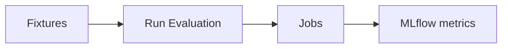

# Streamlit UI — page guide

The Gaussia EvalHub dashboard has three pages in the sidebar:

- **Fixtures** — inspect the included agent conversation scenarios.
- **Run Evaluation** — submit benchmarks for the selected fixture to EvalHub.
- **Jobs** — list and inspect evaluations already submitted to EvalHub.

The UI calls EvalHub directly through the same Python SDK path as `apps/evalhub_job_submission/submit_evalhub_job.py`. It does **not** create OpenShift submit Jobs — those remain Make-only (`make run-humanity`, `make run-all`, `make install-external`).

---

## Getting started

You reach the same UI two ways: **run Streamlit on your laptop** (fastest for development) or **open the Route after Helm deploy on OpenShift**. Both paths need EvalHub reachable and `EVALHUB_*` configured.

### Option A — Run locally

**1. Prerequisites**

- Python 3.12+
- An EvalHub endpoint (cluster install from this quickstart, or an existing service)
- `.env` with at least `EVALHUB_BASE_URL` (and auth if your EvalHub requires it)

**2. Configure environment**

From the repository root:

```bash
make env-init
# Edit .env — set EVALHUB_* for local submit, plus judge/guardian keys for full-suite runs
```

**3. Install and start the UI**

```bash
pip install -r apps/ui/requirements.txt
streamlit run apps/ui/app.py
```

Streamlit prints a local URL (typically **http://localhost:8501**). You should see the Gaussia EvalHub logo in the sidebar with **Fixtures**, **Run Evaluation**, and **Jobs**.

Or build and run the container image with podman (build context is the repository root):

```bash
podman build -f apps/ui/Containerfile.ui -t gaussia-evalhub-ui .
podman run --rm -p 8501:8501 --env-file .env gaussia-evalhub-ui
```

---

### Option B — OpenShift (Helm)

**1. Prerequisites**

- OpenShift cluster with `oc` and `helm` configured
- Platform install completed (`make install` or equivalent) with `ui.enabled=true` (default in `deploy/helm/values.yaml`)

**2. Deploy**

`make install` deploys the Streamlit dashboard with the evaluation platform. The UI ConfigMap injects non-secret `EVALHUB_*` / model settings. `GAUSSIA_JUDGE_API_KEY` and `GAUSSIA_GUARDIAN_API_KEY` come from the chart-managed provider Secret (or `platform.provider.existingSecret`) via `envFrom.secretRef`.

Wait for the UI deployment:

```bash
oc rollout status deployment/gaussia-ui -n gaussia-evalhub-quickstart
```

**3. Get the URL**

```bash
oc get route -n gaussia-evalhub-quickstart gaussia-ui \
  -o jsonpath='https://{.spec.host}{"\n"}'
```

If no Route exists (or you are off-cluster), port-forward instead:

```bash
oc port-forward -n gaussia-evalhub-quickstart svc/gaussia-ui 8501:8501
# Then open http://localhost:8501
```

**4. Rebuild and restart the UI image**

```bash
make ui    # build-ui + push-ui + restart-ui
```

**5. Troubleshooting reachability**

| Symptom | What to check |
|---------|----------------|
| Route 404 or connection refused | `oc logs -n gaussia-evalhub-quickstart deploy/gaussia-ui` — image pull or startup failure |
| Fixtures page empty / error | Fixtures must exist under `apps/evalhub_job_submission/fixtures/` in the image |
| Submit fails on Run Evaluation | Jobs page connection metrics — `EVALHUB_BASE_URL` unset or auth token missing |
| Full-suite submit fails | Judge/guardian keys not in the provider Secret; humanity-only still works |
| Jobs list empty or errors | Same EvalHub URL/tenant as submit; token may lack list permission |

---

### First steps in the UI

Once the page loads:

1. Open **Fixtures** and pick a scenario in the sidebar (first-line support, retail, or root-cause analysis).
2. Skim the conversation and toggle ground-truth responses if you want to see expected answers.
3. Switch to **Run Evaluation**, choose **Humanity only**, and submit.
4. Open **Jobs**, refresh the list, and paste the returned job id for detail.

More detail on what each page does: sections below.

---

## How the pages connect



| Page | Purpose | What happens when you use it |
|------|---------|------------------------------|
| **Fixtures** | Browse scenarios | Loads fixture JSON from disk — no EvalHub calls |
| **Run Evaluation** | Submit benchmarks | Builds a `JobSubmissionRequest` and posts it to the EvalHub API |
| **Jobs** | Inspect history | Lists jobs and fetches a single job by id from EvalHub |

---

## Fixtures

This page **shows the recorded agent conversations** that become Gaussia evaluation datasets. Nothing is submitted from here.

When you select a fixture in the sidebar, the UI:

1. Shows summary cards for all included scenarios (active fixture highlighted).
2. Displays metrics: interaction count, language, scenario name, and evaluated model.
3. Renders scenario context and expandable fixture metadata (session, stream, control ids, model URL).
4. Walks the conversation turn by turn (user → assistant). Toggle **Show ground-truth responses** to compare against expected answers.
5. Offers a **Raw JSON** expander with the full fixture payload.

| Fixture | Scenario | Interactions |
| --- | --- | --- |
| `first-line-support` | IT first-line support troubleshooting | 10 |
| `retail` | Retail shopping and support assistant | 10 |
| `root-cause-analysis` | SRE root-cause analysis assistant | 10 |

Use this page to understand what will be evaluated before you spend judge/guardian tokens on **Run Evaluation**.

---

## Run Evaluation

This page **submits the selected fixture to EvalHub** — the same path as `submit_evalhub_job.py`, without creating an OpenShift submit Job.

### Available benchmarks

The page lists the six Gaussia metric families and whether they need external models:

| Benchmark | What it measures | Models |
| --- | --- | --- |
| `humanity` | Emotional tone and entropy across assistant replies | None required |
| `context` | Answer alignment with conversation context | Judge model |
| `conversational` | Dialogue quality — memory, Grice maxims, sensibleness | Judge model |
| `agentic` | Match to ground-truth expected answers | Judge model |
| `bias` | Bias across protected attributes | Guardian model |
| `toxicity` | Toxic language and harmful associations | Embeddings / lexicon |

For metric family detail, see [Gaussia metric families](gaussia-metric-families.md).

### Run configuration

1. Choose **Benchmark Scope**:
   - **Humanity only** — no external models; good first smoke test.
   - **All benchmarks** — selector uses `auto` (six benchmarks for the included fixtures when judge/guardian are configured).
2. Leave **Unique run suffix** enabled so repeated submits get distinct session/stream/control ids.
3. Click **Submit**. On success you get a JSON payload with `job_id` and `benchmark_ids`.

Use **Dry run (preview request)** to build the `JobSubmissionRequest` without calling EvalHub — useful when validating fixture wiring or Env config.

After submit, copy the `job_id` and continue on **Jobs**, then confirm metrics in MLflow ([Validate results](../README.md#validate-results)).

---

## Jobs

This page **inspects evaluations already in EvalHub**. Cluster submit Jobs from Make are a separate path; this page only talks to the EvalHub API.

### Connection strip

Four metrics summarize the active EvalHub client:

| Metric | Source |
| --- | --- |
| EvalHub URL | `EVALHUB_BASE_URL` |
| Tenant | `EVALHUB_TENANT` (default `default`) |
| Insecure TLS | `EVALHUB_INSECURE` |
| Auth token | set / unset from `EVALHUB_AUTH_TOKEN` or `EVALHUB_AUTH_TOKEN_PATH` |

### Recent jobs

1. Set the **Limit** slider (5–50).
2. Click **Refresh job list**.
3. Review the table: `job_id`, `name`, `status`, `created_at`.

### Job detail

Paste a job id (from a UI submit or Make run) and click **Get job** for the full EvalHub job JSON.

---

## Configuration that changes behavior

These environment variables alter *what the UI can do*, not just labels on screen:

| Variable | What it changes |
|----------|-----------------|
| `EVALHUB_BASE_URL` | Target EvalHub API for submit, list, and get |
| `EVALHUB_TENANT` | Tenant used for job operations |
| `EVALHUB_AUTH_TOKEN` / `EVALHUB_AUTH_TOKEN_PATH` | Auth for EvalHub API calls |
| `EVALHUB_INSECURE` | Allow insecure TLS when talking to EvalHub |
| `EVALHUB_EXPERIMENT_NAME` | Experiment name stamped on submissions |
| `GAUSSIA_JUDGE_*` / `GAUSSIA_GUARDIAN_*` | Required for **All benchmarks** provider runs (not for humanity-only) |

Full install and secret wiring: [README.md](../README.md), [How it works](how-it-works.md), [apps/ui/README.md](../apps/ui/README.md).
